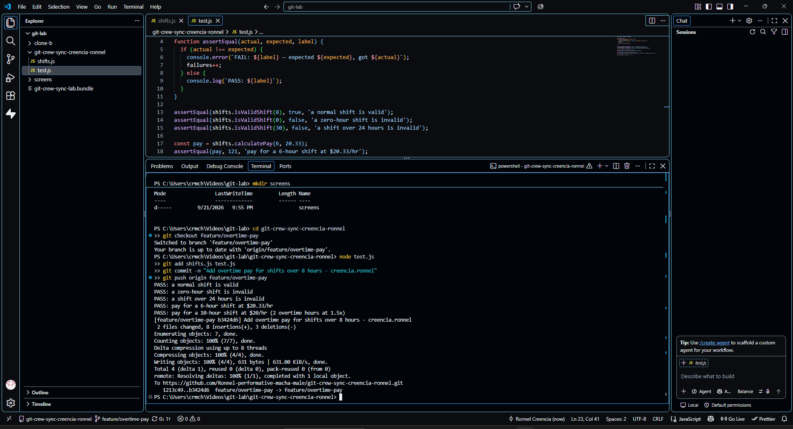
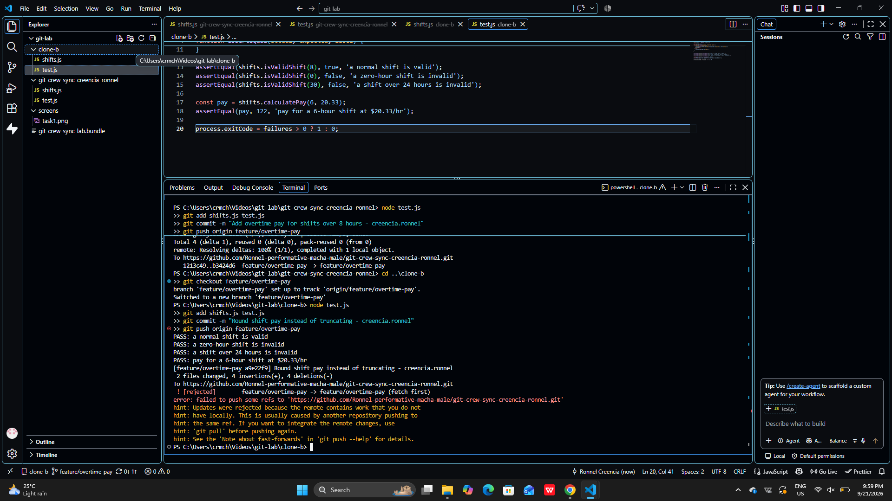
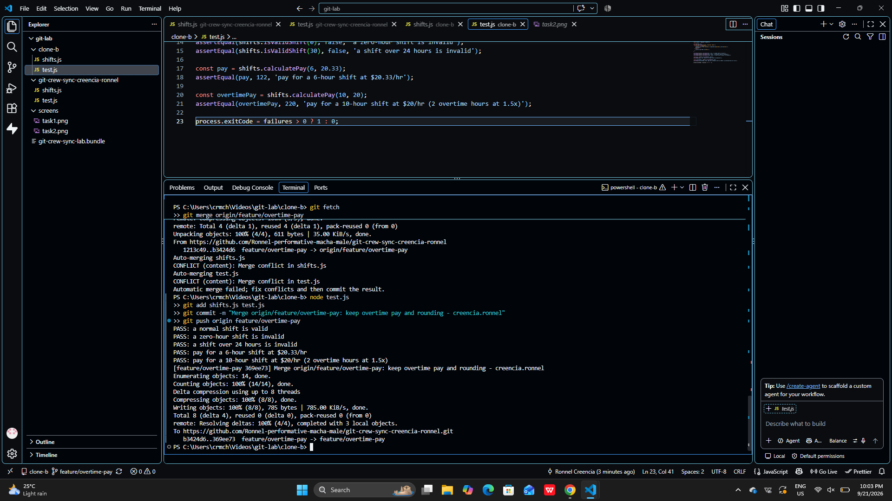
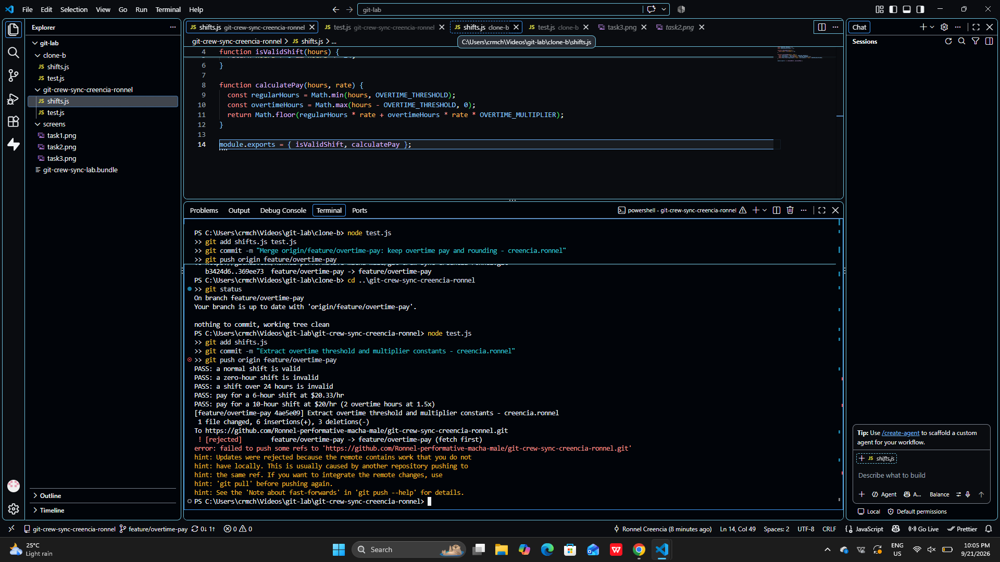
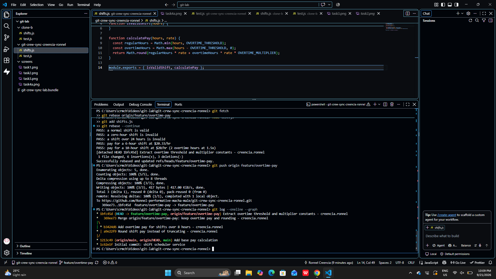
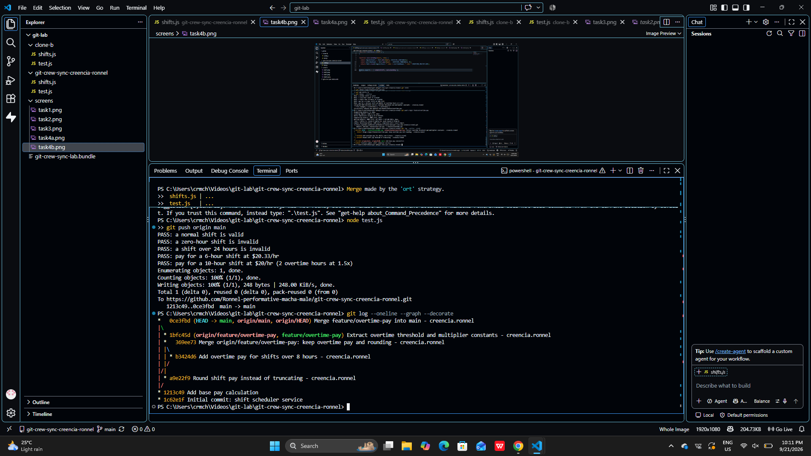
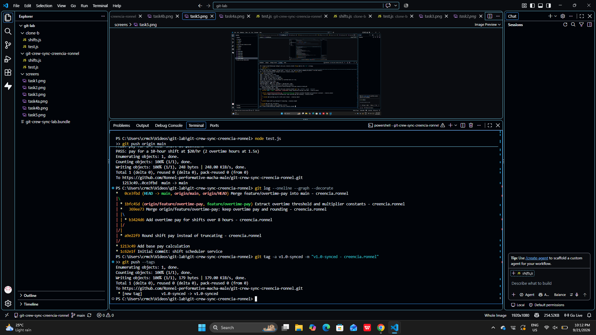
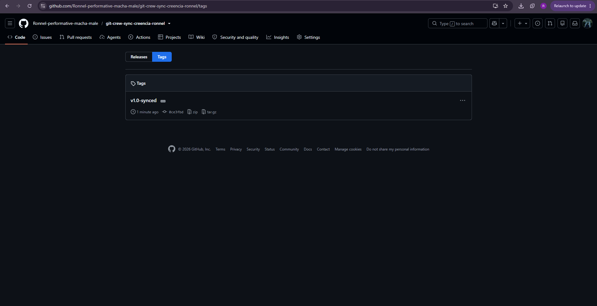

# WORKFLOW

Repository: git-crew-sync-creencia-ronnel

## Task 1: Push a change from Clone A

## Task 2: Diverge from Clone B and get rejected

## Task 3: Reconcile with a merge

## Task 4: Diverge again and reconcile with a rebase

## Task 5: Merge into main

## Task 6: Tag v1.0-synced

## Questions

### 1. What did the rejected push error message tell you, and why did it happen?

(your answer)

### 2. What's the actual difference between how you resolved Task 3 (merge) vs Task 4 (rebase)?

(your answer)

### 3. What one habit would have avoided both rejected pushes in this lab?

(your answer)

### 4. Which approach, merge or rebase, would you default to on a shared team branch, and why?

(your answer)